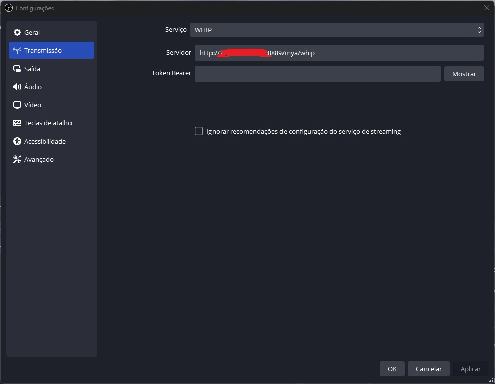
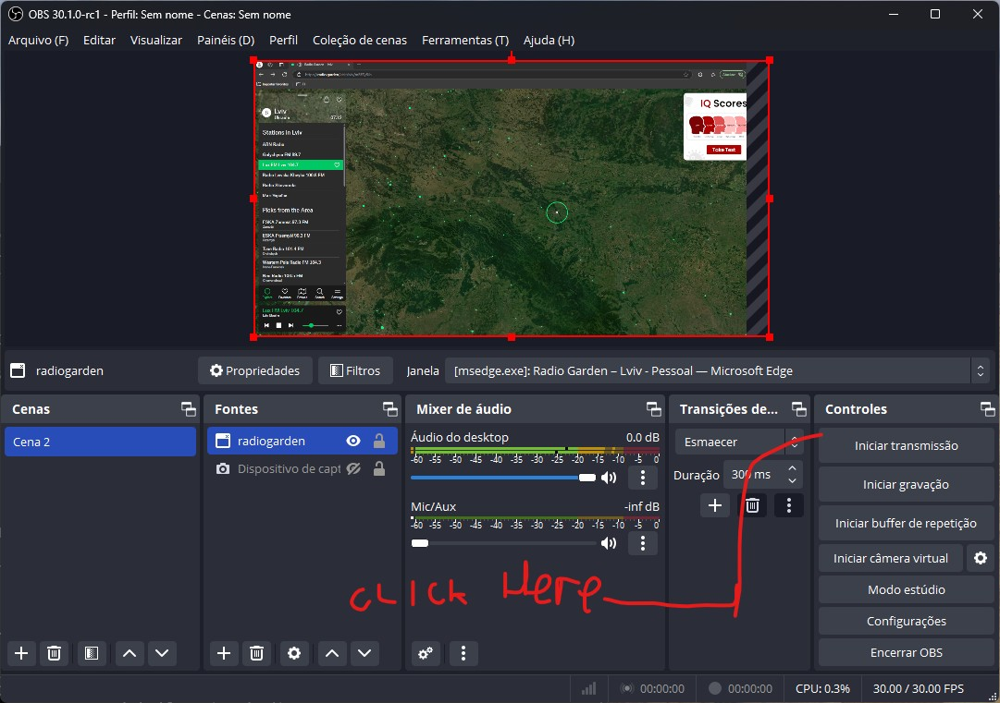
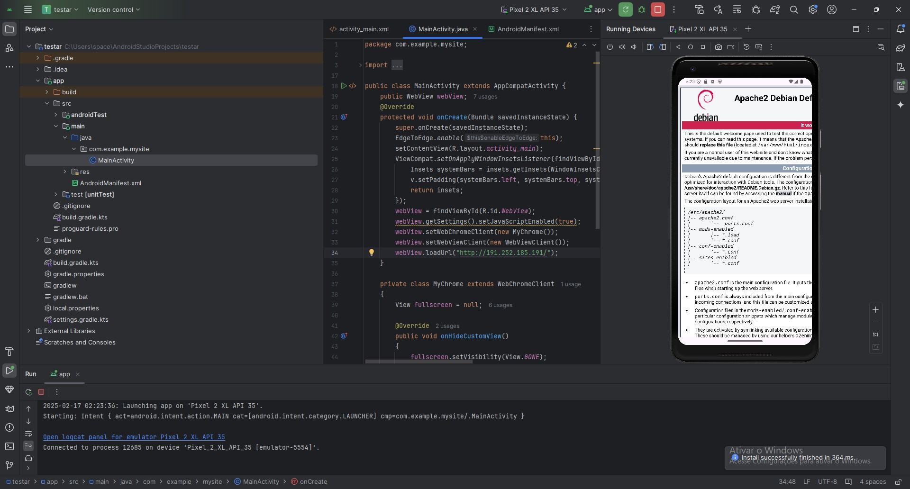

# SYSTEM OF STREAMMING WITH APP SMARTPHONE

The system no longer uses Docker from another project, this project has support for several other protocols that carry out transmission, 
RTMP or webrc that will be used where a page that will carry out transmission will be built,
other protocols are more used with video programs, VLC...

### install 
$docker run --rm -it --network=host bluenviron/mediamtx:latest

### AFTER
docker run --rm -it \
-e MTX_RTSPTRANSPORTS=tcp \
-e MTX_WEBRTCADDITIONALHOSTS=192.168.x.x \
-p 8554:8554 \
-p 1935:1935 \
-p 8888:8888 \
-p 8889:8889 \
-p 8890:8890/udp \
-p 8189:8189/udp \
bluenviron/mediamtx


MODIFY O IP XXX.XXX.XXX FOR USE. The app smartphone use 10.xxx.x.x Think. why do I speak


# SITE

```
<!DOCTYPE html>
<head lang="pt-br">
    <meta charset="utf-8">
    <title> TEXT STREAMMER</title>
  <style type="text/css"> 
        html { 
            overflow: auto; 
        } 
          
        html, 
        body, 
        div, 
        iframe { 
            margin: 0px; 
            padding: 0px; 
            height: 100%; 
            border: none; 
        } 
          
        iframe { 
            display: block; 
            width: 100%; 
            border: none; 
            overflow-y: auto; 
            overflow-x: hidden; 
        } 
    </style> 
    </head>
    <body>

<a href="index.html">LINK</a>
        <iframe src="http://XXX.XXX.XXX.XXX:8889/mya/" scrolling="no"  allowfullscreen width="100%" height="100%"></iframe>

    </body>
</html>
```

# HOW TO USE
AFTER INSTALLING THE AFTER PHASE. CREATE THE SITE.

$docker run --rm -it \
-e MTX_RTSPTRANSPORTS=tcp \
-e MTX_WEBRTCADDITIONALHOSTS=192.168.x.x \
-p 8554:8554 \
-p 1935:1935 \
-p 8888:8888 \
-p 8889:8889 \
-p 8890:8890/udp \
-p 8189:8189/udp \
bluenviron/mediamtx


MODIFY O IP XXX.XXX.XXX FOR USE

USE OBSTUDIO IN SETTINGS SEARCH FOR TRANSMISSION
THEN CHOOSE WHIP, THEN ON THE SERVER PUT ACCORDING TO THE

``` http://xxx.xx.xxx.xxx:8889/mya/whip ```

[]

### AFTER

[]

## APP Smartphone

The application is configured, i.e. the apk, to respond to a certain IP, perhaps you know the good ones.10. 
Just create a page or website or play what I said directly and it will open in the app.
The first time you open it will be the shape it takes.

[


